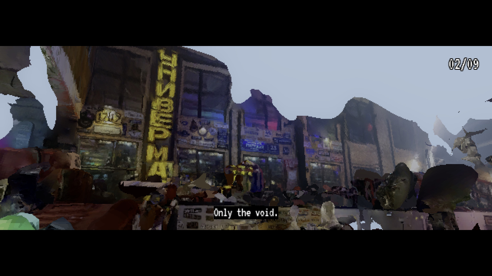
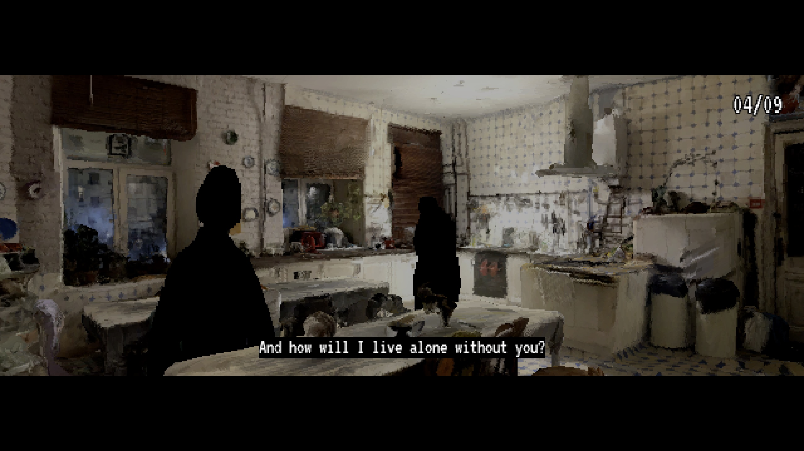
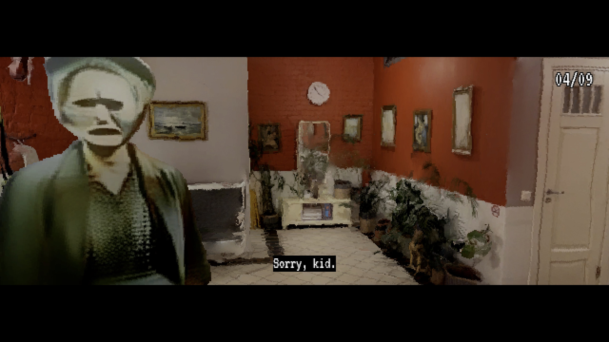
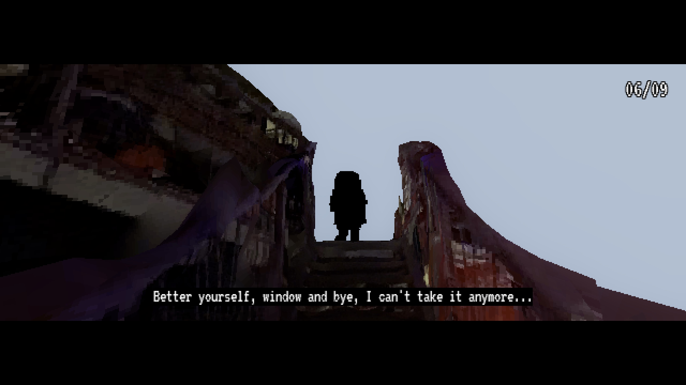

# ld52
Game from Ludum Dare #52

There is time to live and time to regret about ended live. In the end, we all must harvest our regrets about life to understand, was it worth it to wait the end that long?

Click people nearby to talk with them about their regrets about life. You need to find and talk with 9 people.

* **WASD** to walk
* **Left** click to talk
* **ESC** to exit game
* **R** to restart game

### Play
[in browser](http://upisfr.ee/game/ld52/) or download for [Windows](https://github.com/upisfree/ld52/releases/download/1.1.0/ld52.exe), [macOS](https://github.com/upisfree/ld52/releases/download/1.1.0/ld52.dmg) or [Linux](https://github.com/upisfree/ld52/releases/download/1.1.0/ld52.linux.x86_64.zip). 

### Playthrough

### Screenshots

